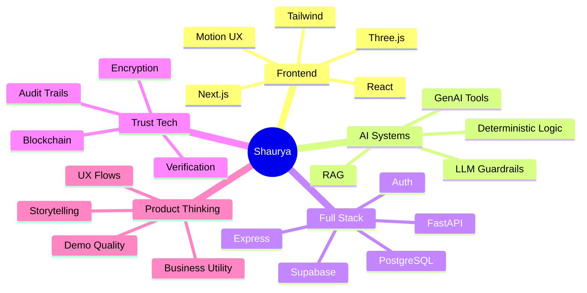

<div align="center">


<br />

<a href="https://github.com/Shaurya002800">
  
</a>
<a href="https://github.com/Shaurya002800?tab=followers">
  
</a>


</div>

---

<table>
<tr>
<td width="58%">

## ⚡ About Me

I am **Kunwar Shaurya**, a B.Tech CSE student specializing in **AI & Data Engineering** at **VIT Vellore**.

I like building projects that do not just look good in a demo, but feel like real products — with clear user flows, polished interfaces, technical depth, and a reason to exist.

My work sits at the intersection of:

* **Frontend Engineering** — React, Next.js, Tailwind, motion-heavy UX
* **AI/ML Systems** — GenAI tools, deterministic + LLM hybrid workflows
* **Full-stack Products** — auth, databases, APIs, deployment, dashboards
* **Trust Infrastructure** — blockchain, verification, security-focused flows
* **UI/UX Thinking** — product storytelling, interaction design, visual systems

</td>
<td width="42%">

## 🧭 Current Build Direction

```txt
Role I am growing into:
Product Engineer / AI Full-stack Developer

What I build:
Useful AI tools
Clean web products
Trust-based systems
Creative interfaces

What I care about:
Clarity
Speed
Polish
Real-world utility
```

</td>
</tr>
</table>

---

## 🧩 Featured Build Deck

<table>
<tr>
<td width="50%">

### 🚀 DevBoard

**Indie Talent Marketplace**

A full-stack platform where founders post scoped software projects and developers apply with focused pitches.

**Why it matters:**
It solves the messy “cold DM + unclear requirement” problem by turning project hiring into a structured marketplace.

**Stack:**
`Next.js` `React` `Tailwind` `Express` `PostgreSQL` `JWT` `Railway` `Vercel`

<a href="https://github.com/Shaurya002800/devboard">
  
</a>

</td>
<td width="50%">

### 🔐 ExamChain

**Zero-trust Examination Infrastructure**

A security-first exam system combining encrypted question vaults, integrity agents, blockchain logs, and verifiable result credentials.

**Why it matters:**
It attacks the full exam trust chain — paper leak prevention, live integrity monitoring, tamper-proof result proof.

**Stack:**
`FastAPI` `React` `PostgreSQL` `Redis` `Solidity` `Hardhat` `Web3.py` `AES-256`

<a href="https://github.com/Shaurya002800/ExamChain">
  
</a>

</td>
</tr>

<tr>
<td width="50%">

### 💸 SpendLens

**AI Spend Audit Tool**

A web app that helps startups audit subscriptions like Cursor, Claude, ChatGPT, Copilot, and Gemini to detect tool overlap and estimate savings.

**Why it matters:**
It turns AI-tool chaos into a simple, useful business audit with deterministic logic and AI-generated explanations.

**Stack:**
`Next.js` `Supabase` `Anthropic SDK` `Resend` `Jest` `TypeScript`

<a href="https://github.com/Shaurya002800/ai-spend-audit">
  
</a>

</td>
<td width="50%">

### 🪐 AstroMl / Serenova

**Deterministic + Guarded LLM Consultation Engine**

An internal consultation assistant that computes structured Vedic chart data and uses AI only as a guarded synthesis layer.

**Why it matters:**
It separates deterministic domain calculations from LLM narration, reducing hallucination and unsafe claims.

**Stack:**
`Python` `Streamlit` `FastAPI` `Swiss Ephemeris` `Encryption` `LLM Guardrails`

<a href="https://github.com/Shaurya002800/AstroMl">
  
</a>

</td>
</tr>

<tr>
<td width="50%">

### 🛡️ SentinelMesh

**Edge AI + IoT Threat Network**

A decentralized threat-intelligence prototype using ESP32 nodes, on-device inference, mesh communication, and blockchain incident anchoring.

**Why it matters:**
It explores how physical devices can detect and communicate security events without depending fully on cloud infrastructure.

**Stack:**
`ESP32` `TensorFlow Lite Micro` `React` `Socket.IO` `D3.js` `Polygon` `Web3.py`

<a href="https://github.com/Shaurya002800/Sentinelmesh">
  
</a>

</td>
<td width="50%">

### 🌊 Grand Line Portfolio

**Creative Developer Portfolio**

A motion-heavy portfolio experiment blending frontend engineering, 3D interaction, storytelling, and visual identity.

**Why it matters:**
It shows the design-engineering side: not just building apps, but shaping memorable experiences.

**Stack:**
`React` `Vite` `Three.js` `React Three Fiber` `GSAP` `Framer Motion`

<a href="https://github.com/Shaurya002800/D_Shaurya">
  
</a>

</td>
</tr>
</table>

---

## 🧠 Engineering Identity



---

## 🛠️ Tech Stack

<div align="center">

### Languages


### Frontend


### Backend & Database


### Tools


</div>

---

## 📊 GitHub Signal

<div align="center">


<br />


</div>

---

## 🧪 How I Think While Building

<table>
<tr>
<td>

### 01. Problem First

I try to define the actual pain point before touching the interface or code.

</td>
<td>

### 02. Product Flow

I care about user journeys, edge cases, dashboards, demo paths, and clarity.

</td>
<td>

### 03. System Depth

I like projects with architecture, not just screens — auth, storage, APIs, logic, deployment.

</td>
</tr>
<tr>
<td>

### 04. Visual Polish

I believe good engineering should feel usable, premium, and intentional.

</td>
<td>

### 05. AI With Control

I prefer deterministic logic + AI assistance instead of letting LLMs invent everything.

</td>
<td>

### 06. Ship Fast, Improve Fast

I build, test, polish, document, and iterate in public.

</td>
</tr>
</table>

---

## 🎯 Currently Looking For

I am open to **paid internships** and serious project opportunities in:

* Frontend Engineering
* Full-stack Development
* AI/ML Engineering
* GenAI Product Development
* UI-focused Product Engineering

I am especially interested in teams building useful AI products, developer tools, productivity software, trust systems, and creative interfaces.

---

## 🛰️ Connect

<div align="center">

<a href="https://github.com/Shaurya002800">
  
</a>
<a href="https://www.linkedin.com/in/kunwar-shaurya-24581529b/">
  
</a>
<a href="https://shauryaportfolio-sage.vercel.app/">
  
</a>

</div>

---

<div align="center">

### “I do not just build projects. I try to build proof.”


</div>
